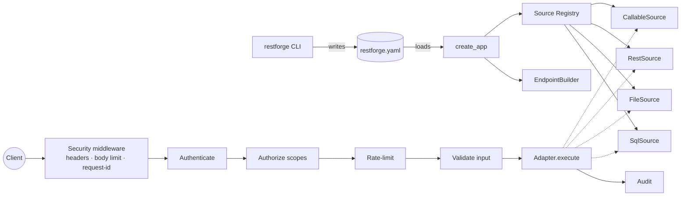
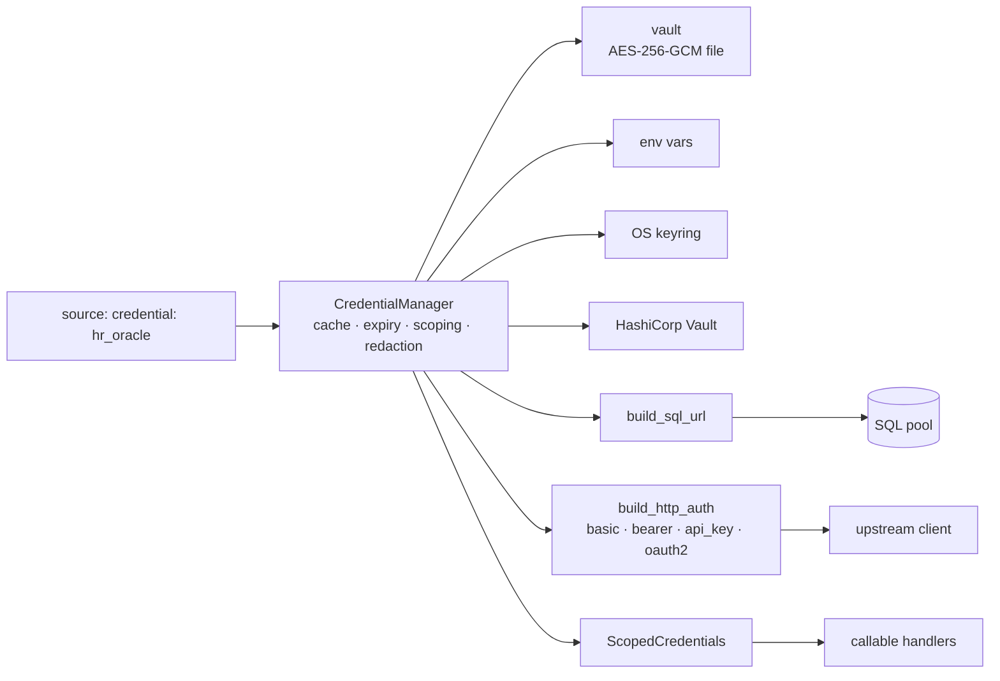

# restforge – Architecture & Design

## 1. Recommended pattern: Declarative spec + Hexagonal core + Request pipeline

The framework combines a small number of well-known patterns, each with one job:

| Concern | Pattern | Where |
|---|---|---|
| What the API exposes | **Declarative specification** (config-as-code). One YAML file is the single source of truth; CLI writes it, server reads it, Git versions it. | `config.py`, `restforge.yaml` |
| Talking to data | **Ports & Adapters (Hexagonal)**. One `DataSource` port; SQL, file, REST and callable are adapters. The HTTP layer never knows which backend it is calling. | `sources/base.py`, `sources/*.py` |
| Choosing an adapter | **Registry + Factory** with plugin entry points (`restforge.sources`). New backends (Mongo, Snowflake, Kafka…) plug in without editing the core – Open/Closed principle. | `create_source`, `@register` |
| Turning specs into routes | **Builder**. `EndpointBuilder` generates FastAPI routes, pydantic validators and OpenAPI docs from each `EndpointSpec`. | `builder.py` |
| Per-request processing | **Pipeline / Chain of Responsibility**. Every request, whatever the source, goes through the same ordered stages. | `EndpointBuilder._make_handler` |
| Authentication | **Strategy** (API key, JWT; add OIDC/mTLS/LDAP as new classes) chained by an `Authenticator`. | `security/auth.py` |
| Connection secrets | **Credential Manager façade over a provider chain (Strategy)** – vault, env, OS keyring, HashiCorp Vault – with typed credentials and builders that turn them into SQLAlchemy URLs / HTTP auth. | `credentials/` |
| Swappable infrastructure | **Interface + dependency injection** for rate limiter, audit sink, sources. | `RateLimiter`, `create_app(...)` |
| Wiring | **Application Factory**. `create_app(config)` builds a fully isolated app – easy to test, embed, or run multiple tenants. | `server.py` |

### Why this combination
* **Security is centralised.** Because every endpoint runs through one pipeline, a control (auth, scopes, rate-limit, validation, audit) is implemented once and cannot be forgotten on a new endpoint.
* **Adding a data source is local.** Implement `validate_endpoint` + `execute`, register it – nothing else changes.
* **Endpoints are data, not code.** They can be reviewed in pull requests, diffed, promoted between environments and validated in CI (`restforge validate`) before they ever run.



## 2. Components

```
restforge/
  config.py          Pydantic models for the spec, ${ENV:VAR} secret resolution, load/save
  builder.py         EndpointBuilder: param models, OpenAPI, request pipeline
  server.py          create_app() factory, system routes (/health, /auth/token, /_meta/*)
  cli.py             Typer CLI
  sources/
    base.py          DataSource port, ExecutionContext, SourceError, registry/factory
    sql.py           Any SQLAlchemy dialect – raw query mode and table CRUD mode
    files.py         CSV / JSON / JSONL / XLSX, sandboxed to data_root
    rest.py          Upstream HTTP facade with SSRF protection
    callable.py      Allow-listed Python functions (sync or async)
  credentials/
    types.py         Credential types, validation, SQL URL + HTTP auth builders (OAuth2 flow)
    providers.py     Encrypted file vault, env, OS keyring, HashiCorp Vault KV v2
    manager.py       CredentialManager (chain, cache, expiry, rotation, scoping, log redaction)
  security/
    auth.py          Principal, AuthStrategy, ApiKeyStrategy, JwtStrategy, Authenticator
    hashing.py       API-key + scrypt password hashing
    ratelimit.py     RateLimiter interface + in-memory sliding window
    middleware.py    Security headers, request IDs, body-size limit (pure ASGI)
    audit.py         JSON-lines audit log with rotation
```

## 3. Security model (defence in depth)

**Transport & edge**
* Binds to `127.0.0.1` by default; warns when exposed on all interfaces without TLS. Native TLS via `server.ssl_certfile/ssl_keyfile`, or terminate TLS at Traefik/Nginx (`proxy_headers` honoured only from trusted proxies). HSTS is sent when TLS is configured.
* Security headers on every response (`nosniff`, `DENY` framing, strict CSP, `no-store`, `no-referrer`), `Server` header suppressed.
* Request body size limit enforced on both `Content-Length` and the streamed bytes.
* CORS off by default; wildcard origins are refused.

**Authentication** – *deny by default*: an endpoint is protected unless explicitly `public: true` (CLI warns).
* **API keys** `rf_<id>_<secret>` with 256-bit entropy; only the SHA-256 hash is stored, the key is shown once; constant-time comparison; expiry (default 90 days) and revocation.
* **JWT** for users: short TTL, algorithm pinned (no `none`/alg confusion), `iss`/`aud`/`exp` required, secret ≥ 32 chars from env. Passwords hashed with scrypt; dummy-hash on unknown users prevents username enumeration; login throttled per IP *and* per username.

**Authorization** – scopes per endpoint (`employees:read`, `employees:write`), `*` = admin. `crud` generates separate read/write scopes. Admin-only `/_meta` routes.

**Input validation** – a strict pydantic model per endpoint: types, min/max, max_length (default 1024), regex, enums; unknown query/body fields are rejected (mass-assignment protection); validation errors never echo input values. Pagination bounded by `max_limit`.

**Data-access guards per adapter**
* SQL: bound parameters only; identifiers come from the spec and are verified by reflection; single statement only; binds must be declared; `read_only` sources (default) allow only SELECT/WITH and roll back every transaction; column allow-lists hide sensitive fields. Pair with a least-privilege DB account.
* Files: sandboxed to `data_root` (resolves `..` and symlinks), read-only, size-capped, field allow-list.
* REST upstream: host allow-list (deny by default), no redirects, URL-encoded path params, only declared params forwarded, caller credentials never forwarded, timeouts and response size caps.
* Callables: module allow-list, private functions refused, only declared params passed.

**Secrets / connection credentials** – never in YAML. Sources reference a credential by name (`credential: hr_oracle`) or a field (`${CRED:name.field}`); `${ENV:VAR}` is still supported.
* *Typed*: `database`, `basic`, `bearer`, `api_key`, `oauth2`, `generic` – required/secret fields are validated; builders create the SQLAlchemy URL (correct escaping of special characters) or the HTTP auth (OAuth2 client-credentials tokens fetched, cached, refreshed early and on 401).
* *Encrypted at rest*: AES-256-GCM per credential, unique nonce, name+type bound as associated data (blobs can't be swapped or edited undetected), key-check record detects a wrong master key, atomic writes, file mode 600. Master key lives only in the environment (or is a scrypt-stretched passphrase); `cred rekey` rotates it.
* *Least privilege*: callables see only credentials listed on their source (`ScopedCredentials`); OAuth token hosts must be allow-listed.
* *Lifecycle*: expiry dates with startup warnings and hard failure when expired; `cred rotate` is picked up by running servers within `cache_ttl_seconds`, which rebuild DB pools / HTTP clients without restart; `cred remove` refuses while in use.
* *Fail fast*: every referenced credential is resolved at startup; a missing/expired/locked one aborts the boot with a clear message.
* *No leaks*: credentials have a secret-free `repr`; a logging filter scrubs every loaded secret value and URL passwords from log lines and tracebacks; `/_meta/credentials` (admin) shows inventory and usage only.



**Errors & observability** – adapters raise client-safe `SourceError`s; anything unexpected becomes a generic 500 with a `request_id`, details are logged server-side only. Every call is audited (who, what, status, latency, IP) without bodies or credentials.

**Abuse protection** – per-principal (or per-IP for anonymous) rate limits, per-endpoint overrides, `Retry-After` on 429.

## 4. Extending

```python
from restforge import DataSource, register

@register("mongo")
class MongoSource(DataSource):
    def validate_endpoint(self, ep): ...
    async def startup(self): self.client = ...
    async def execute(self, ctx):  # ctx.params are already validated
        return await self.client[ctx.endpoint.table].find_one({"_id": ctx.params["id"]})
```
Publish it as a package with `[project.entry-points."restforge.sources"] mongo = "pkg:MongoSource"`.

## 5. Production roadmap
1. **Distributed rate limiting** – Redis implementation of `RateLimiter` (needed with >1 worker/instance).
2. **Identity store** – move API keys/users from YAML to a DB table; add OIDC (Azure AD/Okta) `AuthStrategy`. Add Azure Key Vault / AWS Secrets Manager credential providers (same `CredentialProvider` interface).
3. **Hot reload** of `restforge.yaml` without restart (currently `serve --reload` in dev).
4. **Response caching** per endpoint (TTL) and ETags.
5. **Row-level security** – inject principal attributes (tenant, region) as mandatory SQL binds.
6. **Metrics** – Prometheus `/metrics`, OpenTelemetry tracing using the existing request IDs.
7. **Async drivers** (asyncpg) for very high concurrency SQL workloads.
